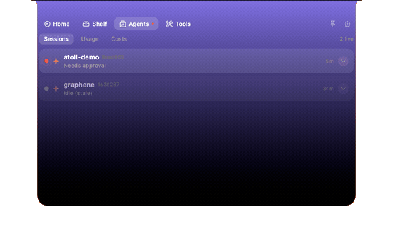
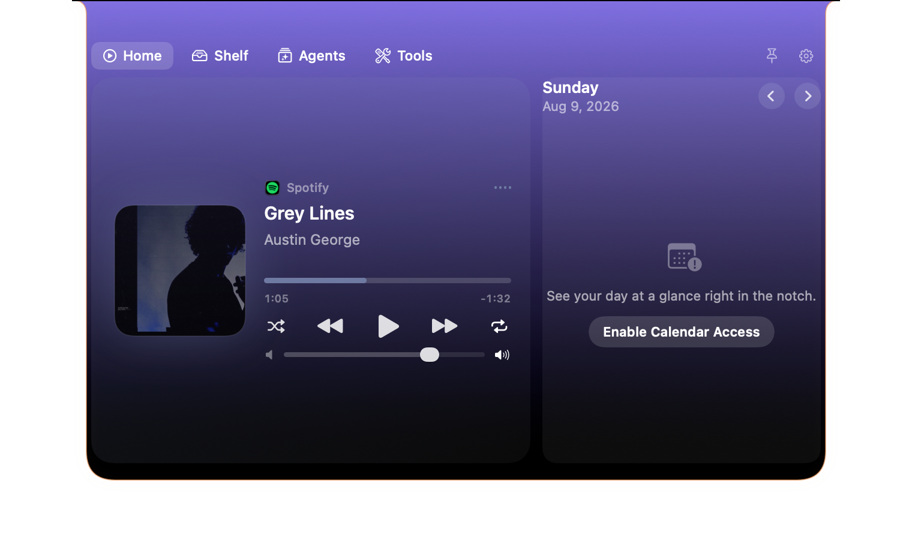
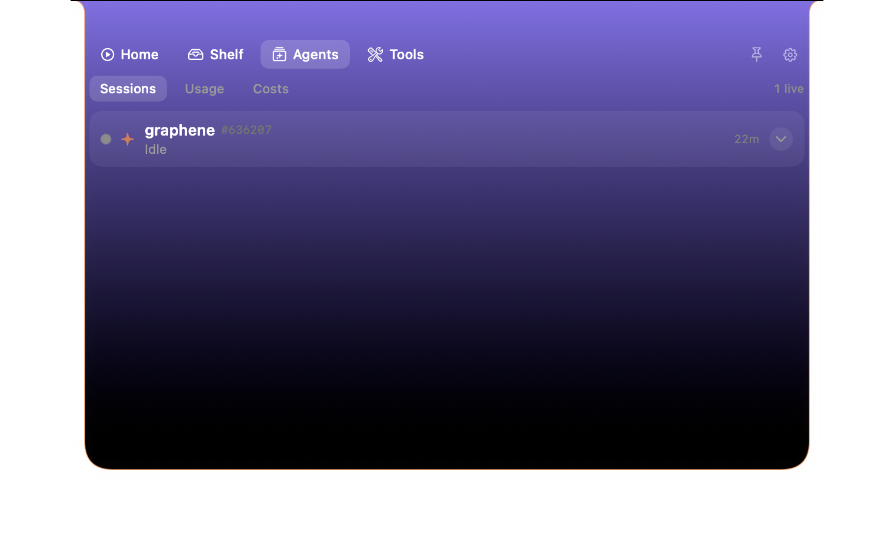
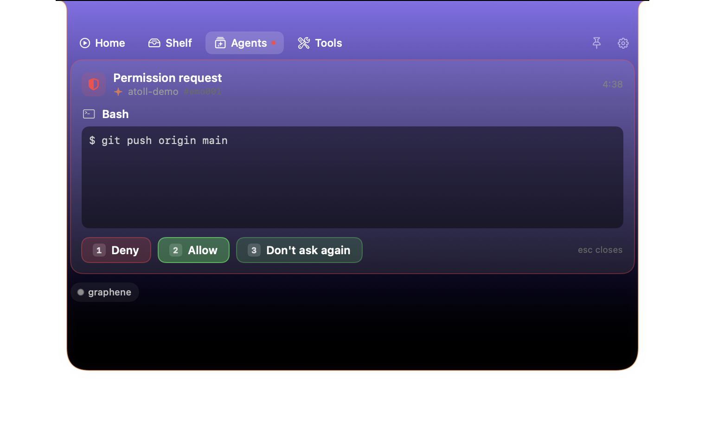
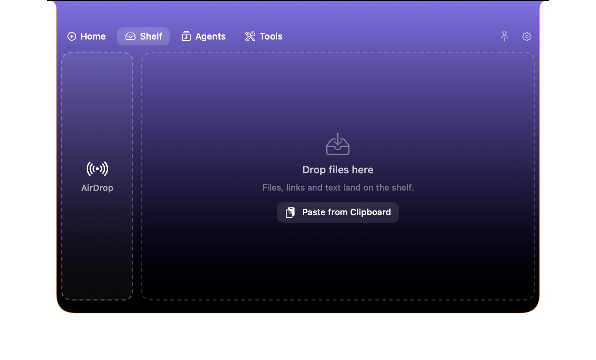

# Atoll

**The MacBook notch, upgraded twice.** Atoll is an open-source macOS notch hub that
replicates the full NotchNook feature set — and then goes further by putting your live
**Claude Code and Codex sessions** in the notch, Notchi-style: watch agents work, get
pinged when they need you, and approve tool permissions without switching to the terminal.

> macOS 14+ · Apple Silicon & Intel · Swift/SwiftUI · no sandbox (it can't be — see below)

## Install

Grab the latest universal DMG and drag Atoll to Applications:

```bash
curl -L -o Atoll.dmg https://github.com/rutmehta/Atoll/releases/download/v0.3.1/Atoll-0.3.1.dmg
open Atoll.dmg
```

Or build from source: `./scripts/build-app.sh && open dist/Atoll.app`

> Heads-up: the current release is ad-hoc signed, so macOS shows a one-time
> Gatekeeper prompt on first launch (see **Known limitations**). Follow
> [Notarized builds](#notarized-builds-distribute-without-gatekeeper-warnings) to ship
> zero-warning installs.

## The hook in action

A Claude Code session runs in the notch — watch it work, get pinged when it needs you,
and approve a tool permission without leaving the notch:



## Screenshots

**Home** — media, calendar and widgets in the notch:



**Agents** — live Claude Code / Codex session monitor with state, tool feed and usage:



**Permission approval** — the red pulse means an agent is waiting; approve right there:



**Shelf / tray** — drag files, links and text (plus AirDrop) to the notch:



## Features

### The Nook (NotchNook parity)
- **Dynamic notch** — invisible at rest, reacts on hover, expands into a widget hub with
  spring morph animations. Works on notchless/external displays with a virtual notch.
- **Tray / Shelf** — drag files at the notch (it auto-opens), stash them, Quick Look with
  Space, multi-select, drag back out anywhere, paste from clipboard, and an **AirDrop drop
  zone** for files, text, and links.
- **Media player** — system-wide now-playing (any app: Music, Spotify, browsers, VLC) with
  artwork, draggable seek bar, shuffle/repeat, and an animated visualizer; artwork-tinted UI;
  live activity wings on the closed notch; AppleScript fallback for Spotify/Music.
- **Calendar** — your day at a glance, swipe between days, pick calendars, click to open.
- **Mirror** — webcam preview in the notch (built-in, external, Continuity).
- **Timers** — countdown + stopwatch with a closed-notch live countdown.
- **Notes** — quick capture notes with autosave.
- **To-dos** — favorites, complete-with-strikethrough, auto-archive.
- **Shortcuts** — run your macOS Shortcuts from the notch.
- **HUD replacement** — volume/brightness keys render as sleek in-notch indicators instead
  of the system bezel (needs Accessibility; off by default).
- **Live activities** — battery/charging events, Bluetooth connects, timer countdowns,
  now-playing, all rendered in the closed notch wings.

### Agent sessions (the Notchi part)
- **Live session monitor** — every Claude Code and Codex session appears in the notch with
  state (working / running tool / waiting for input / compacting), project name,
  permission-mode badge, tool activity feed, and last assistant message.
- **Remote permission approvals** — when an agent asks for permission, the notch pulses red;
  approve / approve-and-remember / deny right there. `AskUserQuestion` prompts render with
  clickable options and free-text answers.
- **Attention notifications** — sound + notification when a session needs input or finishes,
  auto-muted when your terminal is already frontmost.
- **Jump to terminal** — click a session to focus the exact terminal/IDE it's running in
  (Terminal, iTerm2, Warp, Ghostty, kitty, WezTerm, VS Code, Cursor, Zed, JetBrains, …).
- **Usage meters** — Claude 5-hour/weekly limit bars and Codex rate-limit windows with
  reset countdowns.
- **Cost dashboard** — 30-day per-model spend computed from your local transcripts.

How it works: an opt-in hook install (Settings → Agents → *Install hooks*) registers a tiny
shell hook in `~/.claude/settings.json` and `~/.codex/hooks.json` that streams session events
to a local Unix socket (`/tmp/atoll.sock`). Transcript tailing fills in the rest. The
hook exits instantly when Atoll isn't running — zero overhead. Uninstall removes only
Atoll's entries.

## Build & run

```bash
./scripts/build-app.sh          # → dist/Atoll.app
open dist/Atoll.app
```

Requires Xcode (or CLT) with Swift 6 toolchain. The app is ad-hoc signed; permissions
(Calendar, Camera, Accessibility, Notifications, Automation) are requested on first use of
each feature.

## Why no sandbox / App Store?

Same reason as every notch hub: reading system-wide now-playing uses the
`mediaremote-adapter` technique (a perl-spawned bridge to MediaRemote), HUD replacement
uses a CGEvent tap, and brightness uses a private framework. All of that is incompatible
with sandboxing.

## Architecture

```
Sources/Atoll/
  App/        entry point, app delegate, status item, settings window
  Core/       notch geometry, NSPanel host, view model, settings store
  UI/         notch shape, root/open/closed views, settings root
  Features/   Media · Shelf · CalendarWidget · Mirror · Timers · Notes · Todos ·
              ShortcutsRunner · HUD · SystemEvents · Agents · AgentsUI
docs/         DESIGN.md (module contract) + research notes
```

Design notes and the full research corpus (NotchNook feature census, Notchi architecture,
boring.notch techniques, macOS API recipes) live in [docs/](docs/).

## Credits & prior art

- [NotchNook](https://lo.cafe/notchnook) by lo.cafe — the feature blueprint.
- [Notchi](https://github.com/sk-ruban/notchi) — the agent-session-in-the-notch concept.
- [boring.notch](https://github.com/TheBoredTeam/boring.notch) — proven implementation
  techniques for notch windows, media, and HUDs.
- [mediaremote-adapter](https://github.com/ungive/mediaremote-adapter) (+ the
  [ejbills Swift package fork](https://github.com/ejbills/mediaremote-adapter)) — now-playing
  access on modern macOS.

Atoll is a clean-room reimplementation informed by public documentation and
open-source references; it bundles no NotchNook assets or code.


## Known limitations

Honest caveats so you're not surprised:

- **Not notarized (yet).** Released DMGs are ad-hoc signed, so a fresh Mac shows a
  Gatekeeper warning on first launch (Open Anyway) until a Developer ID certificate is
  set up. `scripts/make-app.sh` → `scripts/notarize.sh` documents the one-time Apple
  setup; [Notarized builds](#notarized-builds-distribute-without-gatekeeper-warnings)
  turns that into one command. Until then, expect the quarantine prompt.
- **No sandbox, no App Store.** System-wide now-playing, the HUD event tap and brightness
  need capabilities the sandbox forbids (see *Why no sandbox / App Store?*).
- **Agent hooks are opt-in.** Sessions only show up in the notch after you install the
  hooks in *Settings → Agents → Install hooks*, and only while Atoll is running. It
  tracks Claude Code and Codex sessions that emit hook events — non-interactive or
  print-mode runs may not appear.
- **One-time permissions per feature.** Calendar, Camera, Accessibility, Notifications
  and Automation are each requested on first use; everything is off until then.
- **Notch geometry varies by display.** A real notch is cleanest; notchless and external
  displays use a virtual notch whose look can differ across panels.

## Notarized builds (distribute without Gatekeeper warnings)

One-time setup:

1. **Developer ID Application certificate** — requires a paid Apple Developer
   membership; only the **Account Holder** can create this cert type. Easiest
   path: Xcode → Settings → Accounts → your team → Manage Certificates → **+**
   → *Developer ID Application* (or developer.apple.com → Certificates).
2. **App-specific password** for notarytool: create one at
   [account.apple.com](https://account.apple.com) → Sign-In and Security →
   App-Specific Passwords, then store it:

   ```bash
   xcrun notarytool store-credentials atoll-notary \
     --apple-id you@example.com --team-id YOURTEAMID --password <app-specific-pw>
   ```

Then every release is one command:

```bash
./scripts/notarize.sh    # build universal → sign (hardened runtime) → notarize → staple → DMG
```

The output DMG installs on any Mac with no quarantine friction. Unsigned local
builds remain `./scripts/build-app.sh`; un-notarized DMGs `./scripts/package-dmg.sh`.

## License

MIT
